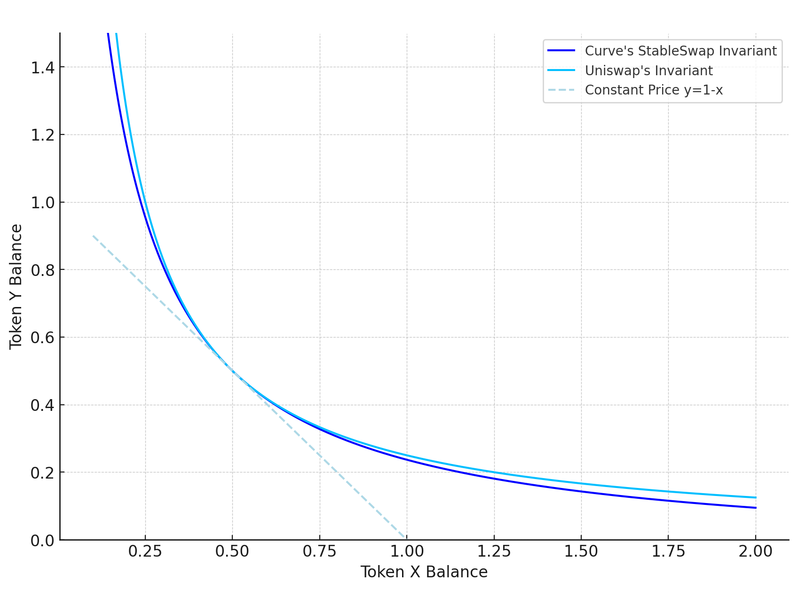

# Blockchain & DeFi

## Economic Protocol Design at RDX Works

While serving as Lead Economist at RDX Works (Radix layer-one protocol developer), I applied systems thinking and macroeconomic principles to design the economics of an algorithmic, partially-collateralized stablecoin protocol. This involved:

- Designing economic incentive structures and stability mechanisms for a decentralized stablecoin with focus on protocol-level risk controls
- Using macroeconomic frameworks (feedback loops, shock propagation, tail-risk management) to analyze nonlinear dynamics in liquidity management
- Applying network science principles to understand protocol-level contagion risks and cascade dynamics
- Designing market microstructure adapted to blockchain-native constraints (block times, MEV, atomic composability)

## Stablecoins: Taxonomy & Design

I studied a number of stablecoin projects both collateralised (fully or partially, on-chain and off-chain) and algorithmic (Constant Function Market Makers):

    
<b>Collateralized Stablecoins:</b> Multi-Collateral DAI, Terra-Luna, Frax, FEI, USDT, USDC

    
<b>Design dimensions:</b> Collateralization ratio, diversification, liquidation mechanics, governance incentives

## Automated Market Makers & Market Microstructure

I analyzed AMM mechanisms and their market microstructure implications based on research including [Tarun Chitra's](https://web.stanford.edu/~boyd/papers/pdf/cfmm.pdf) and [Uniswap v.3](https://uniswap.org/whitepaper-v3.pdf) and [Curve](https://curve.fi/files/stableswap-paper.pdf) whitepapers:

 
    
<b>Core AMM Concepts:</b> Liquidity Pools, Impermanent Loss, Slippage, Miner Extractable Value (MEV), Protocol fees

    
<b>Price impact & execution:</b> Constant product formula, concentrated liquidity, bonding curves

    
<b>Risk factors:</b> Slippage, divergence loss, toxicity from informed flow, flash loan risks

## S&P Global Crypto Research

At S&P Global, I have co-authored research on cryptocurrency market structure, liquidity and risk.

### Liquidity Demographics in Crypto

[**A dive into liquidity demographics for crypto asset trading**](https://www.spglobal.com/en/research-insights/special-reports/liquidity-demographics-for-crypto-asset-trading) (S&P Global, 2025) — co-authored research analyzing participant behavior and market microstructure in cryptocurrency trading, measuring how quickly an asset can be transformed into fiat or stablecoins without significant cost or price dislocation. The research examined:

- Trading participation patterns across time zones and market regimes
- Liquidity concentration and market depth evolution
- Micro-structural drivers of price efficiency and volatility
- Insights for CFMM designs focused on reducing price impact and slippage

### Bitcoin Volatility & Market Dynamics

[**Bitcoin Volatility Trends: A Deep Dive into Market Dynamics and Risk**](https://www.spglobal.com/en/research-insights/special-reports/bitcoin-volatility-trends-deep-dive) (S&P Global, 2026) — co-authored research examining Bitcoin's evolving role in financial markets. Key findings:

- Bitcoin volatility, while still higher than traditional assets, is on a long-term downtrend as institutional adoption grows
- The perpetual-futures-dominated trading structure (leverage + automated liquidations) amplifies price volatility
- Bitcoin functions more as a hedge against long-term currency debasement than against short-term inflation
- Deeper integration with traditional finance (spot ETFs, corporate treasury allocations) introduces new linkages and risks

This work has informed my thinking on liquidity-aware protocol design and the role of market microstructure in stable-asset protocols, with ongoing interest in CFMM designs that reduce price impact and slippage.