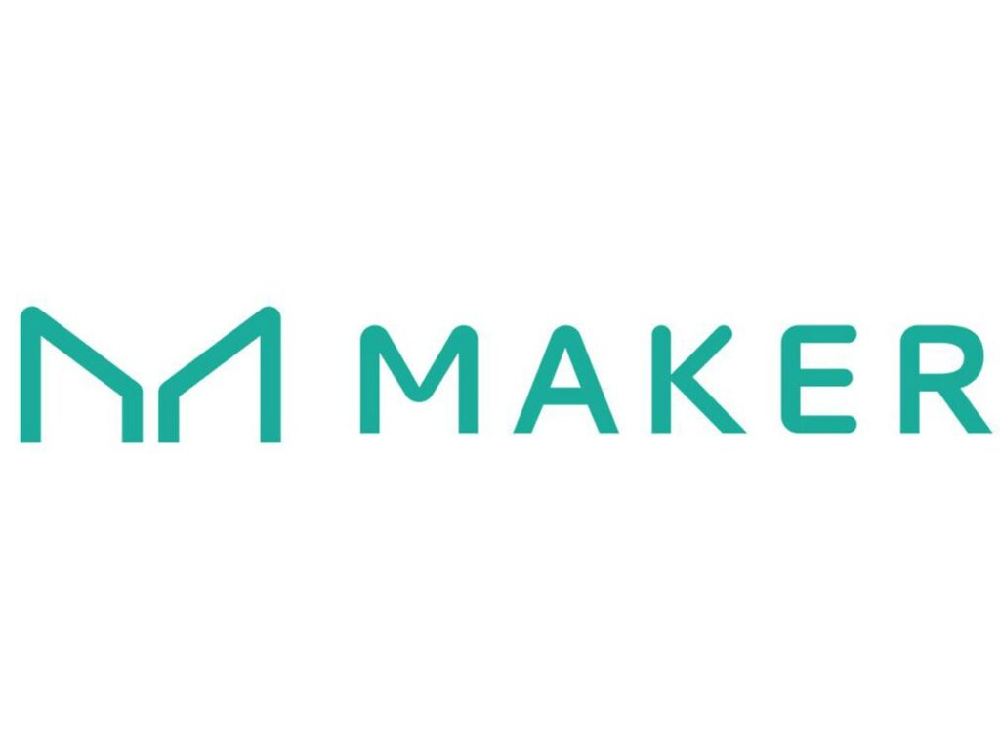

# Blockchain

## Stablecoins
I  looked into a number of stablecoin projects both collateralised (fully or partially, on-chain and off-chain) and algorithmic (Constant Function Market Makers) including

    
Multi-Collateral DAI, Terra-Luna

    
Frax, FEI

    
USDT, USDC

## Automated Market Makers
I looked into a number of papers on AMMs, [Tarun Chitra's](https://web.stanford.edu/~boyd/papers/pdf/cfmm.pdf) papers, [Uniswap v.3](https://uniswap.org/whitepaper-v3.pdf), [Curve WP](https://curve.fi/files/stableswap-paper.pdf), etc., and investigated concepts like :

 
    
Liquidity Pools & Impermanent Loss

    
Linear & Angular Slippage 

    
Miner Extractable Value (MEV)

    
Protocol fees

