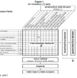

# Data Gaps & Solutions 

## ***Data Pre-processing*** 

###  Consistency

####  Gap
*Same variable, different conventions*

NGFS/PRA/EBA/HKMA/CCAR definitions
Statistical Agency definitions
Climate Agency standards

####  Solution
Match definitions based on each regulator’s requirements and definitions used. e.g. align GVA definitions across Jurisdictions  circa 50 countries, 25 sectors. Bespoke dataset version for each regulator.

###  Granularity

####  Gap
*Different levels of aggregation*

Economy vs. Sector 
World vs. Country
Country vs. Region
Portfolio vs. Counterparty

####  Solution
Interpolate data across time frequencies and expand across geographies using off-the-shelve, widely available and industry standard  transformations .

### Completeness

####  Gap
*Different % completeness of data series*

Across time (historical)
Across space (region or country)
Across sector (industry)

####  Solution
Extrapolate data back in time (back-casting) and expand across geographies using off-the-shelve, widely available and accepted statistical transformations. Not modelling to avoid challenge

## ***Data Curation***

### Availability

####  Gap
*Transition and Physical Hazard Data not part of the BAU*

Diverse and multiple feeds 
Formatting 
Lack of awareness

####  Solution
Combine all publicly available data and make all sources available via a single, easy-to-use API one-stop-shop.

###  Source

####  Gap
*Data procured from third parties not primary source data but secondary or tertiary (after assumptions/modeling).*

Use of derived data source
Data provided with unproven analytics  
Lack of transparency  

####  Solution
Investigate, discover and collate all relevant, publicly available datasets

### Update frequency

####  Gap
*Rugged edges problem in economic data management different release dates/update frequencies*

Timely updated/current data
Annual
Quarterly
Monthly

####  Solution	
Prepare coding pipeline to automate update of data on our end so client only ever interacts with final, up-to-date product.
