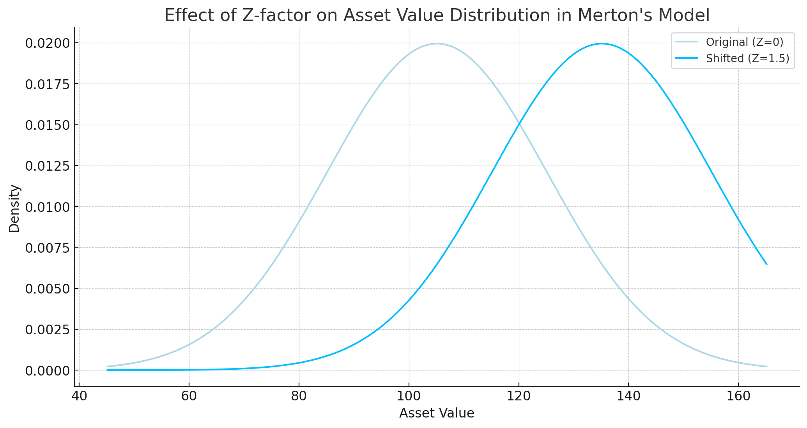
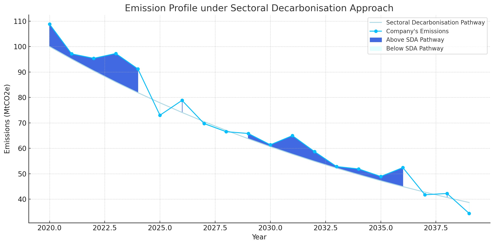
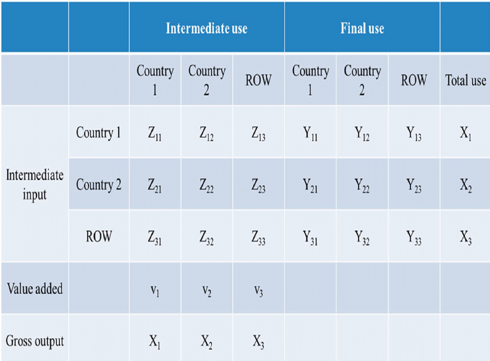
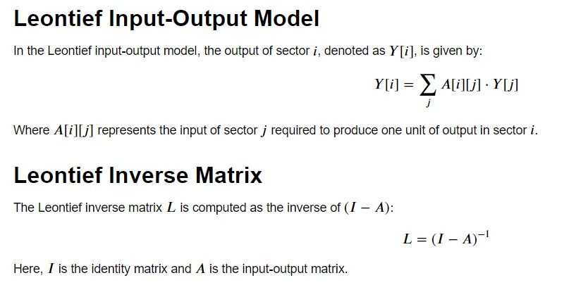

<style>img {width: 250px;height: 150px;margin-right: 15px;float: left;}</style>

# Climate Change

## Transition Risk

### Merton Model
While at PwC, I prototyped and then led team building Transition Risk Climate model in R. Based on OW & UN 2018 paper on [TCFD](https://www.oliverwyman.com/our-expertise/insights/2018/apr/extending-our-horizons.html).


<div>
    <p>PD is estimated via a structural Merton model whereby the distribution of transitions for each sector (Transition Matrix) is shifted by a factor related to climate exposure. We adjust the Distance to Default (DD) to account for impact of carbon taxes and other transition risks on sectoral profits given emissions intensity. Finally, PD = Φ (-DD), where Φ is the CDF of the standard normal. </p>
</div>

### ECL
While at HSBC, I worked on Transition risk PD & LGD model prototypes for the [PRA’s](https://www.bankofengland.co.uk/prudential-regulation) 2021 [Climate Biennial Stress Test](https://www.bankofengland.co.uk/stress-testing/2021/key-elements-2021-biennial-exploratory-scenario-financial-risks-climate-change) and then guided vendor teams in delivery of Transition Risk model suite (incl. Price Elasticity of Demand).


<div>
    <p>Expected Credit Loss (ECL) is a function of Probability of Default (PD), Loss Given Default (LGD) and Exposure at Default (EAD).</p>
    <p>ECL = PD*LGD*EAD </p>
    <p>While there are models for PD & LGD, EAD is often assumed to be fixed or flat for the duration. </p>
</div>

## Physical Risk
While at PwC, I developed a Physical Climate Risk model based on the frequency-severity approach (also known as [Loss Distribution Approach](http://www.thierry-roncalli.com/download/lda.pdf) or LDA) with Monte Carlo VaR. Development in R with Shiny front-end. 


<div>
    <p>LDA is an actuarial method to estimate the expected loss, usually incurred by an insurer, over  a specified time, usually one year.</p>
    <p>Frequency is the number of such events expected to occur over the specified time, e.g. number of wildfires or flood events.</p>
    <p>Severity is the expected cost of each such event, e.g. repairs, disruption, etc.</p>
</div>


<div>    
    <p>Different events are correlated with each other, where appropriate, via a t-Copula.</p>
    <p>The process is then repeated a large nunber of times in a Monte Carlo simulation. </p>
    <p>This allows us to get the distribution of expected losses. </p>
</div>


<div> 
    <p>After we obtain the distribution of expected losses a Value at Risk (VaR) measure is extracted.</p>
    <p>We also consider Expected Shortfall (to better capture fat-tail risks) or Median Shortfall (to further add stability to MC).</p>
</div>

## Sectoral Decarbonisation Approach
While at HSBC, I implemented [SBTi's](https://sciencebasedtargets.org/) [Sectoral Decarbonisation Approach](https://sciencebasedtargets.org/resources/files/Sectoral-Decarbonization-Approach-Report.pdf) (SDA) to estimate sectoral emission profiles (Excel VBA prototype & Python working model).


<div>
    <p>Sectoral intensity is expected to compress or converge with economy in the long-term. Intensity pathway is calculated based on share of sector on GVA and base year intensity.Focus is on Scope 1 and Scope 2 emissions where data is available. Minimize the error between aggregated pathway emissions intensity (estimated) and whole economy (provided).</p>
</div>

## Input/Output Tables
While at PwC, I explored the use of I/O tables, specifically [Environmentally-Extended I/O tables](https://en.wikipedia.org/wiki/Environmentally_extended_input%E2%80%93output_analysis) and Leontief matrices, to enhance macro-economic models of whole-economy GDP and sectoral GVA.


<div>
    <p>An I/O table models the interdependence between different sectors of an economy.Total output is the aggregate of intermediate outputs plus final output  (x=Ax+y).</p> 
    <p>Environment extensions like emissions, waste and other externalities, are appended to the analysis to allow use in estimating transition impacts.</p>
</div>


<div>
    <p>Total output is related to final demand via A, the technical coefficients matrix which depends on the relationships between the various sectors.</p>
    <p>The equation is often expressed using L, the so-called Leontief inverse matrix.</p>
</div>

## Scenario
While at HSBC, I championed use of baseline scenario in CBES ahead of Bank supplying any Baseline numbers or guidance. A [Static Balance Sheet](https://www.openriskmanual.org/wiki/Static_Balance_Sheet_Assumption) (SBS) assumption is required for two-round ST but this implies need for BL scenario to be meaningful. 
- In its [2019 CBES paper](https://www.bankofengland.co.uk/-/media/boe/files/paper/2019/the-2021-biennial-exploratory-scenario-on-the-financial-risks-from-climate-change.pdf?la=en&hash=73D06B913C73472D0DF21F18DB71C2F454148C80) the PRA notes that:

```{note}
To identify the change in impairments driven by climate-related risks in the scenarios, impairment charges would be compared to those in the baseline scenario of the 2020 annual cyclical scenario stress test.
```