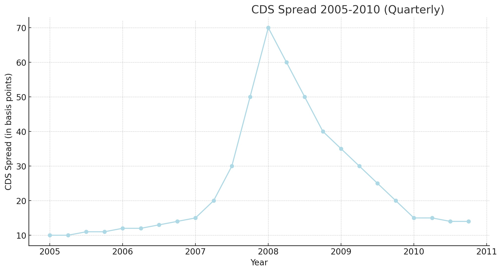
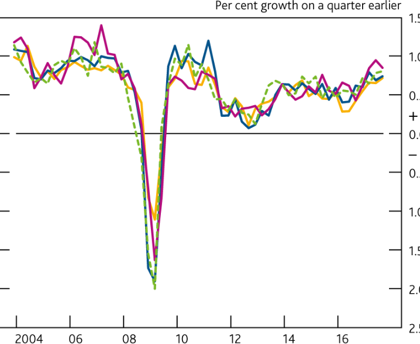
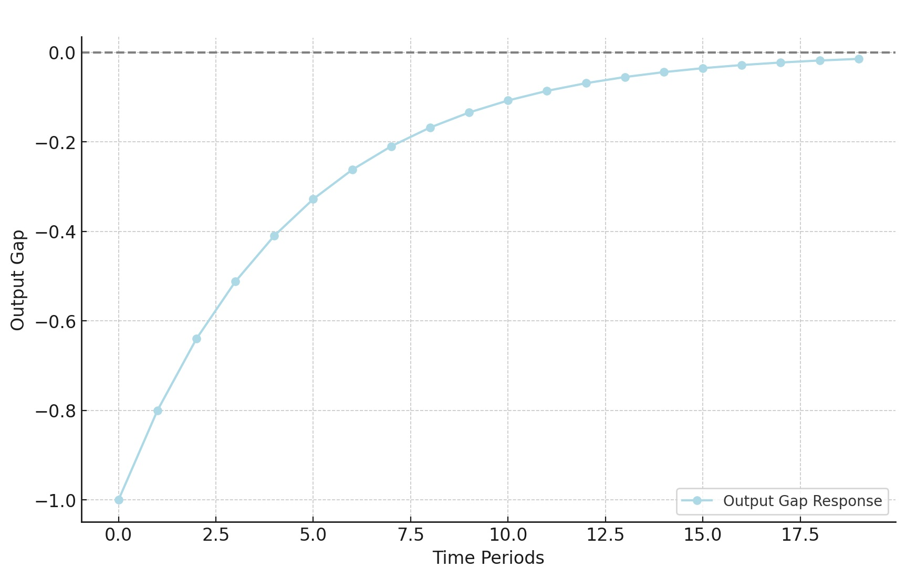

# Macroeconomics

Over the years I have produced econometric models (in EViews, Matlab, R, Excel, Python, VBA) for various business needs as well as written reports (regular or ad-hoc) on a number of macro-themes (EM, DM, China, markets, financial contagion), including producing a number of publications in peer reviewed academic journals.

## Market-implied PD

While at Fathom Consulting, I built a model to extract market-implied conditional Sovereign PD from CDS spreads, based on Bank of England research and the CDS valuation paper of [O'Kane & Turnbull 2003](https://quantlabs.net/academy/download/free_quant_instituitional_books_/%5BLehman%20Brothers%5D%20Valuation%20of%20Credit%20Default%20Swaps.pdf)

The marginal PD is bootstrapped from CDS spreads via a hazard-rate $\lambda(t)$; a bivariate copula then gives the conditional PD of one sovereign defaulting given another, as the ratio of the joint over the marginal:

$$
\mathrm{PD}(t) = 1 - e^{-\int_0^{t} \lambda(s)\,ds},
\qquad
\mathrm{PD}(A \mid B) = \frac{C\big(F_A, F_B\big)}{F_B}
$$

    
Extract the CDS  implied PD using a hazard rate approach.

    
Apply a bivariate copula to the marginal PD distributions of each sovereign and extract the joint distribution.

    
Estimate the conditional PD of one sovereign defaulting, as the ratio of the joint over the marginal.

## Nowcasting GDP

While at Fathom Consulting, I replicated the ECB published [Nowcasting methodology](https://www.ecb.europa.eu/pub/pdf/scpwps/ecbwp1275.pdf?145bf6e35251eedc79d9b1b6ff325e7a) of Reichlin & Giannone, using Kalman filtering, VAR and bridging with factors.

The high-frequency indicators are Kalman-filtered through a linear-Gaussian state space — state transition and noisy observation — to handle ragged-edge release schedules before bridging into GDP:

$$
x_t = F x_{t-1} + w_t, \qquad z_t = H x_t + v_t,
\qquad w_t \sim \mathcal{N}(0, Q),\; v_t \sim \mathcal{N}(0, R)
$$

    
This involves Kalman-filtering the various, high-frequency, inputs.

    
Then we proceed to extract a set of common factors which are then bridged into the appropriate (lower) frequency.
 
    
Gaps are filled to deal with rugged-edges due to asynchronous publication schedules.Finally the factors are used in a VAR to estimate GDP.

## OBR macro model

At NatWest Group (then RBS) I worked on macro-economic scenario design and expansion, building a  scenario expansion engine based on the [OBR's](https://obr.uk/) own [econometric model](https://obr.uk/docs/dlm_uploads/Working-paper-No4-A-small-model-of-the-UK-economy.pdf).

The OBR Small model is based around four core behavioural equations — an IS relation, a Phillips curve, an Uncovered Interest Parity condition, and a central-bank reaction (Taylor) rule:

$$
\begin{aligned}
\textbf{IS relation:} \quad & \tilde{y}_t = a_1\,\tilde{y}_{t-1} - a_2\,(r_t - r^{*}) + \varepsilon_t^{\,y} \\[2pt]
\textbf{Phillips curve:} \quad & \pi_t = \beta\,\mathbb{E}_t \pi_{t+1} + \kappa\,\tilde{y}_t + \varepsilon_t^{\,\pi} \\[2pt]
\textbf{Uncovered Interest Parity:} \quad & \frac{E_t(S_{t+1}) - S_t}{S_t} = i_t - i_t^{*} \\[2pt]
\textbf{Taylor rule:} \quad & i_t = r^{*} + \pi_t + 0.5\,(\pi_t - \pi^{*}) + 0.5\,\tilde{y}_t
\end{aligned}
$$

With a number of extensions for:

    
5. Credit Spreads (I implemented that using a simplified Nelson-Siegel approach)

    
6. Unconventional Monetary Policy (QE)

    
7. Public Finances (Debt Sustainability Analysis equations)

The credit-spread / yield-curve extension uses the Nelson-Siegel factor form (Diebold-Li implementation), decomposing the curve into level $\beta_0$, slope $\beta_1$ and curvature $\beta_2$ factors that are then driven by macro variables:

$$
y(\tau) = \beta_0 + \beta_1\,\frac{1 - e^{-\lambda\tau}}{\lambda\tau} + \beta_2\left(\frac{1 - e^{-\lambda\tau}}{\lambda\tau} - e^{-\lambda\tau}\right)
$$

 

